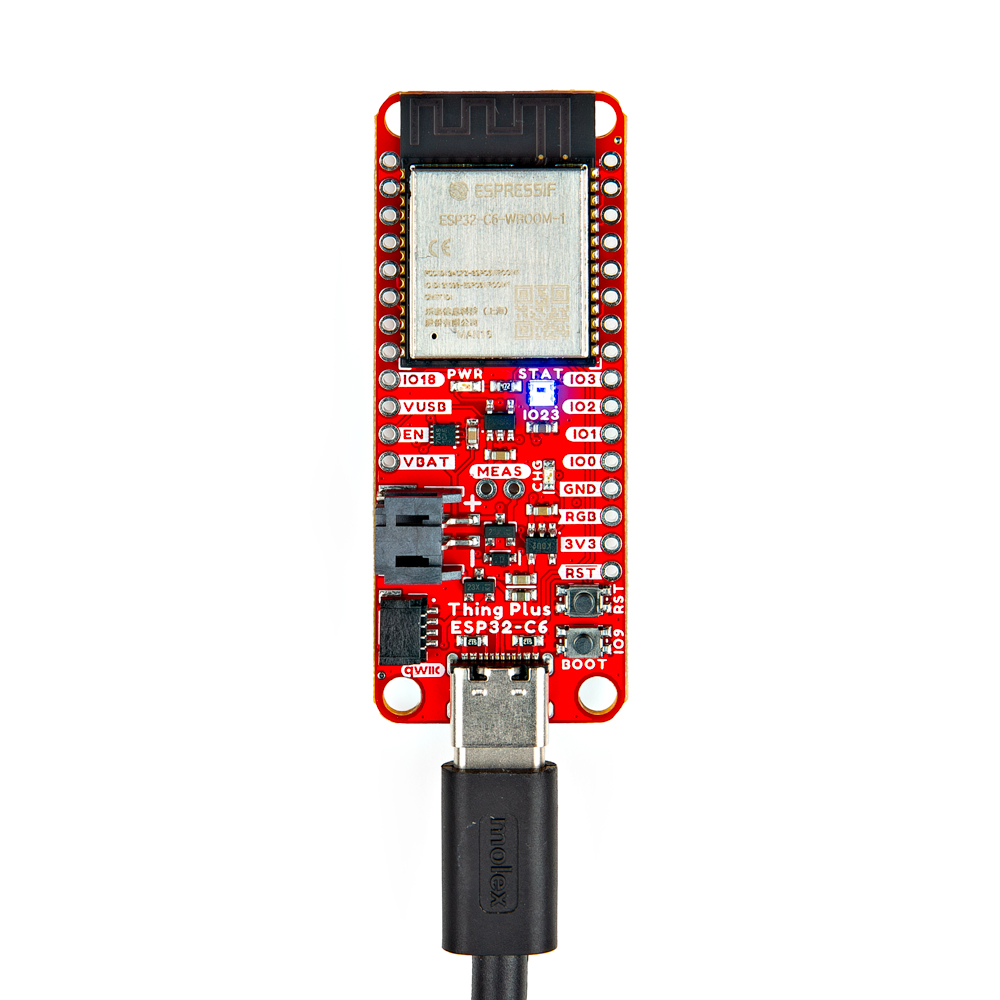

Now that we're familiar with the hardware on this Thing Plus board, it's time to connect it to our computer or battery power.

## Basic USB Assembly

Basic assembly of the Thing Plus ESP32-C only requires a USB-C cable connecting the board to a computer. Just plug the cable into the USB-C connector like the photo below shows and you should see the RGB LED cycling through rainbow colors with the pre-loaded test code. From here, we can move on to installing the espressif boards package in Arduino and uploading code.

<figure markdown>
[{ width="600"}](./assets/img/Thing_Plus_C6-USB_Assembly.jpg "Click to enlarge")    
</figure>

!!! note
    Your computer may not recognize the board as a known USB device if you have not installed the espressif boards package in Arduino and/or installed the espressif IDF.

## Battery Assembly

If you prefer a battery-powered application, plug a single-cell LiPo battery into the 2-pin JST connector on the underside of the board like the photo below. Remember, the MCP73831 only charges the battery when V_USB has voltage present either from the USB-C connector or through the V_USB PTH pin.

<figure markdown>
[{ width="600"}](./assets/img/Thing_Plus_C6-Battery_Assembly.jpg "Click to enlarge")
</figure>

For tips on the proper use of a LiPo battery and the 2-pin JST connector, please read through our [Single Cell LiPo Battery Care](https://learn.sparkfun.com/tutorials/single-cell-lipo-battery-care) tutorial.

## Soldered Assembly

Those who prefer a traditional soldered assembly should solder wires or header pins to the PTH header on the side of the board. If you're not familiar with through-hole soldering or would like a refresher, take a look at our Through-Hole Soldering Tutorial:

-   <a href="https://learn.sparkfun.com/tutorials/5">
    <figure markdown>
    
    </figure>
    </a>
    <a href="https://learn.sparkfun.com/tutorials/5">**How to Solder: Through-Hole Soldering**
    </a>

