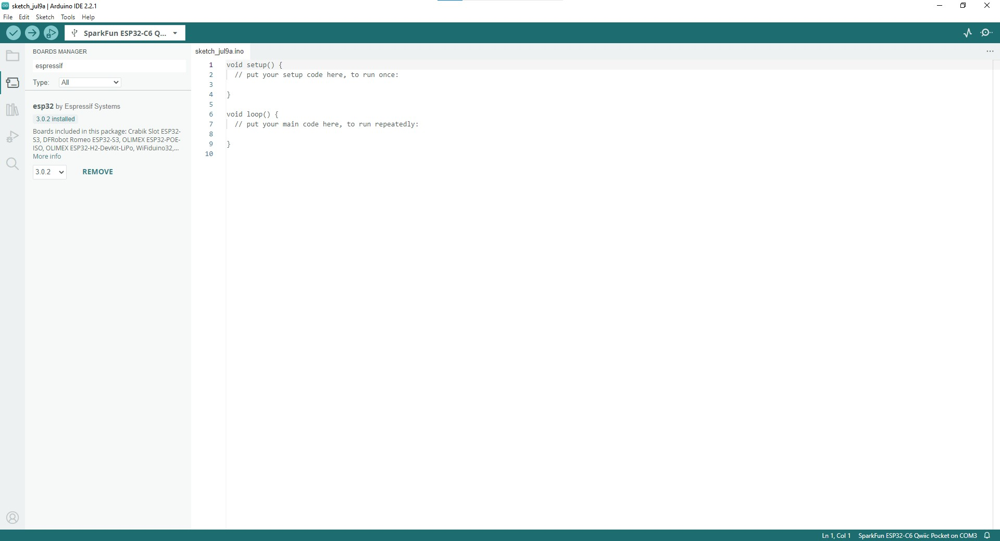

!!! attention
	If this is your first time using Arduino, please read through our tutorial on [installing the Arduino IDE](https://learn.sparkfun.com/tutorials/installing-arduino-ide). If you have not installed an Arduino library before, we recommend you check out our [installation guide](https://learn.sparkfun.com/tutorials/installing-an-arduino-library).

With the ESP32-C6 Thing Plus connected to our computer, it's time to set up the boards package in Arduino.

## Installing espressif Arduino Boards
    
To install the ESP32 boards package, open the Preferences menu by navigating to <b>File</b> > <b>Preferences</b>. Look at the bottom of the Preferences menu for "Additional boards manager URLS" and then copy this JSON link into that field:

<code>
    https://espressif.github.io/arduino-esp32/package_esp32_dev_index.json
</code>

Click "Ok" and then open the *Boards Manager* tool, search for "espressif ESP32" and install the latest release. This install process may take some time so feel free to step away while it downloads and installs.

<figure markdown>
[{ width="600"}](./assets/img/espressif_arduino_boards.jpg "Click to enlarge")
</figure>

## espressif IDF

Users who prefer to use espressif's development toolkit, espressif IDF, can get started by following their instructions [here](https://www.espressif.com/en/products/sdks/esp-idf) and  ESP32-C6 specific documentation [here](https://docs.espressif.com/projects/esp-idf/en/stable/esp32c6/index.html). 